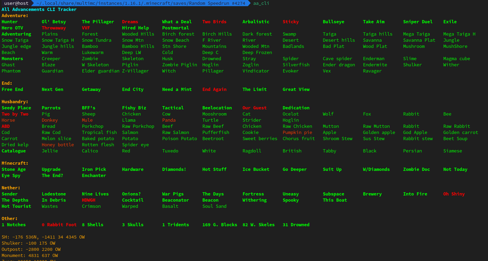

# AA CLI
Cross-platform CLI AA tracker for Linux/MacOS users. Clone the repo and run:
```bash
cargo install --path .
```
to install the CLI. The CLI doesn't currently support active world tracking, so navigate to the world folder and run:
```bash
aa_cli
```

## Example


## Features
- Print out bolan diamonds coordinates by entering `bolan` into the CLI
- Add notes by entering text into the input field. The notes will be saved in the world folder. Warning: notes don't seem to work on my Windows machine, let me know if you have the same issue on a Linux/MacOS machine.
- Clear notes by entering `clear` into the CLI

